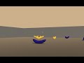

# Introduction

# Environment

The environment solved in this repository is similar to the [Banana collector](https://github.com/Unity-Technologies/ml-agents/blob/master/docs/Learning-Environment-Examples.md#banana-collector) environment of Unity with a single agent (aka brain). In this environment, the agent moves in a two-dimensional plane that is populated with *blue* and *yellow* bananas. The agent's goal is to collect yellow bananas, which gives a reward of +1 for each one, while avoiding blue banas giving a reward of -1 when collected.

The state space is 37-dimensional and contains the agent's velocity and 6 measurement along 6 rays. The action space is discrete with four choices:

+ `0`: move forward faster
+ `1`: move backward
+ `2`: turn left
+ `3`: turn right

The task is episodic (it ends after a fixed amount of time) and is considered solved when the agent receives a mean reward of 13 over 100 episodes.

[](https://www.youtube.com/watch?v=3x2TjeRQb2Q)

# Setup

To set up the environment, perform the following steps (on Linux or Mac):

1. Create a Python 3.6 environment:

```
conda create --name banana python=3.6
source activate banana
```

2. Perform a minimal install of OpenAI Gym

```
git clone https://github.com/openai/gym.git
cd gym
pip install -e .
```

3. Install the "Classic control" and "box2d" environments (the latter needs `swig` to be installed which can be installed with `brew install swig`)

```
pip install -e '.[classic_control]'
pip install -e '.[box2d]'
```

4. Download the environment:

+ [Linux](https://s3-us-west-1.amazonaws.com/udacity-drlnd/P1/Banana/Banana_Linux.zip)
+ [Mac OSX](https://s3-us-west-1.amazonaws.com/udacity-drlnd/P1/Banana/Banana.app.zip)
+ [Windows (32-bit)](https://s3-us-west-1.amazonaws.com/udacity-drlnd/P1/Banana/Banana_Windows_x86.zip)
+ [Windows (64-bit)](https://s3-us-west-1.amazonaws.com/udacity-drlnd/P1/Banana/Banana_Windows_x86_64.zip)

5. Place the downloaded file in the project folder and unzip it.

6. Install the required packages with `pip install -r requirements.txt`

Now you're good to go!

# Solved agent

See here for how the double DQN agent performs:

[](https://www.youtube.com/watch?v=rT_opLZS6SI)
